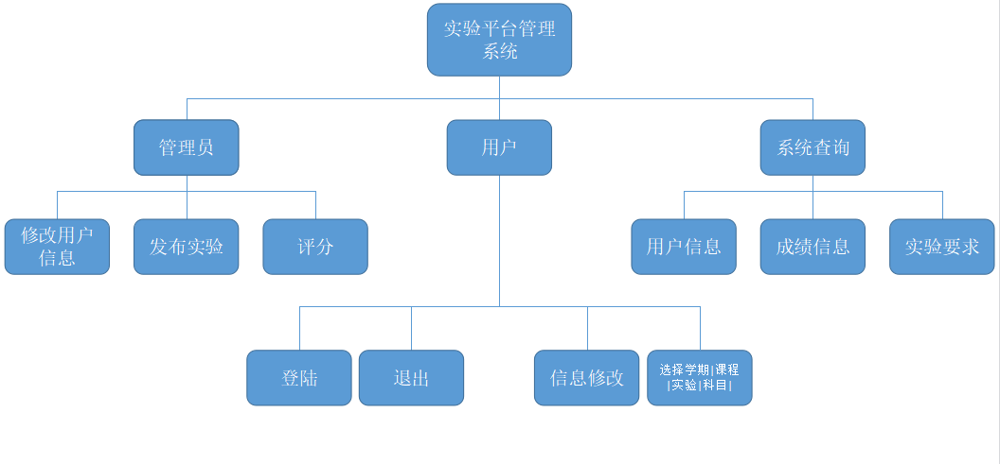
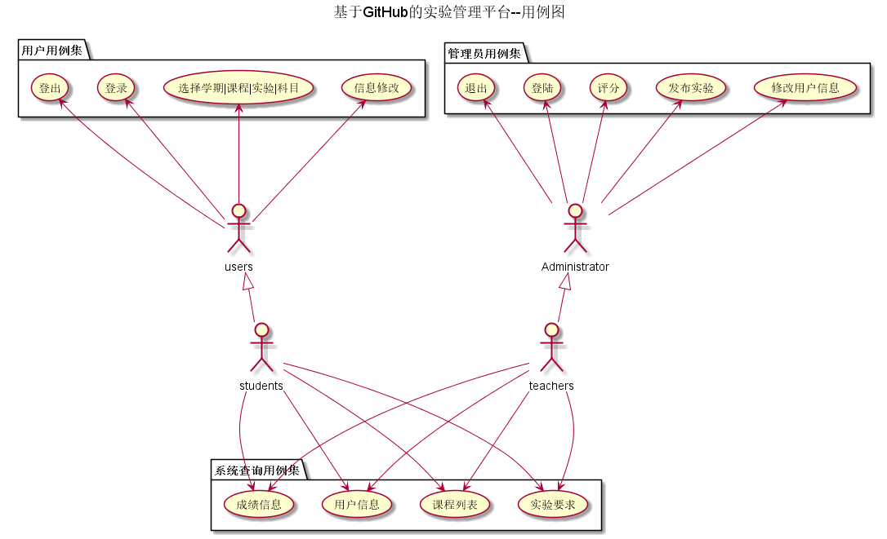
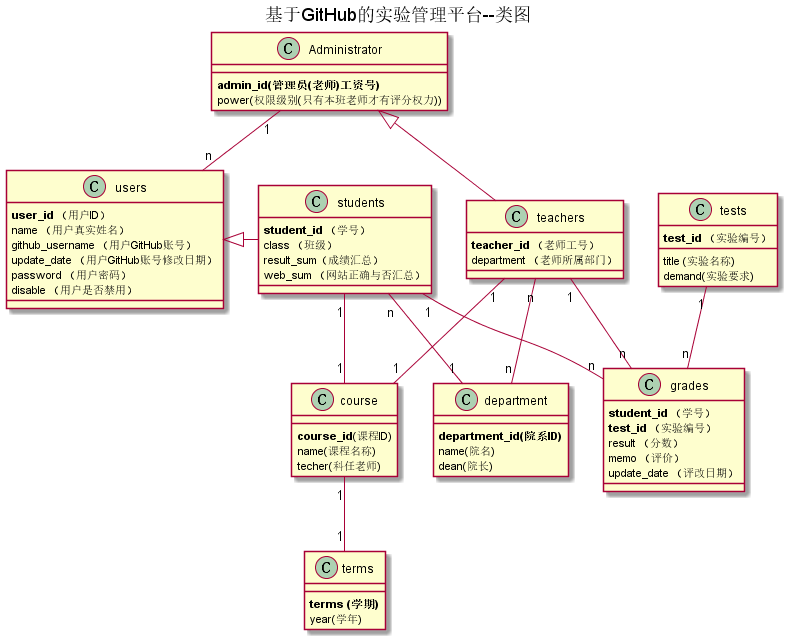


# 基于GitHub的实验管理平台的分析与设计

### 成都大学信息科学与工程学院

## 1. 概述
- 基于GitHub的实验管理平台的作用是在线管理实验成绩的Web应用系统。学生和老师的实验内容均存放在GitHUB
页面上。
- 学生的功能主要有：一是设置自己的GitHub用户名，二是查询自己的实验成绩。学生的GitHub用户名是公开的，但成绩不公开。
- 老师的功能主要有：一是批改每个学生的成绩，二是查看每个学生的成绩。
- 老师和学生都能通过本系统的链接方便地跳转到学生的每个GitHUB实验目录，以便批改实验或者查看实验情况。
- 实验成绩按数字分数计算，每项实验的满分为100分，最低为0分。
- 系统自动计算每个学生的所有实验的平均分。
    
## 2. 系统总体结构

界面设计参见：https://github.com/jgh98423/is_analysis/blob/master/test6/ui/index.html
    
## 3. 用例图设计 [源码](src/UseCase.puml)

## 4. 类图设计 [源码](src/class.puml)

## 5. 数据库设计
- ### [参见数据库设计](./DatabaseDesign.md)

## 6. 用例及界面详细设计
- ### [“课程信息”用例](./uc/CourseList.md),[学生界面](https://github.com/jgh98423/is_analysis/blob/master/test6/ui/课程信息学生端.html)  [教师界面](https://github.com/jgh98423/is_analysis/blob/master/test6/ui/课程信息教师端.html)
- ### [“发布实验”用例](./uc/PublishExeprimentUc.md),[界面](https://github.com/jgh98423/is_analysis/blob/master/test6/ui/管理员.html)
- ### [“学生列表”用例](./uc/StudentList.md),[界面](https://github.com/jgh98423/is_analysis/blob/master/test6/ui/成绩信息教师端.html)
- ### [“查看实验要求”用例](./uc/PublishExeprimentUc.md),[界面](https://github.com/jgh98423/is_analysis/blob/master/test6/ui/成绩信息教师端.html)
- ### [“评定成绩”用例](./uc/EvaluationScore.md),[界面](https://github.com/jgh98423/is_analysis/blob/master/test6/ui/实验.html)
- ### [申请管理员界面](https://github.com/jgh98423/is_analysis/blob/master/test6/ui/申请管理员权限.html)
- ### [“添加班级”用例](./uc/AddClassUc.md)
- ### [“添加课程”用例](./uc/AddCourseUc.md)
- ### [“添加学院”用例](./uc/AddDepartmentUc.md)
- ### [“查看成绩”用例](./uc/ViewScore.md),[界面](https://github.com/jgh98423/is_analysis/blob/master/test6/ui/成绩信息学生端.html)
- ### [“修改密码”用例](./uc/Changepwd.md),[界面](https://github.com/jgh98423/is_analysis/blob/master/test6/ui/修改密码.html)
- ### [“修改用户信息”用例](./uc/AlterUserinfo.md),[学生界面](https://github.com/jgh98423/is_analysis/blob/master/test6/ui/学生信息.html)  [教师界面](https://github.com/jgh98423/is_analysis/blob/master/test6/ui/教师信息.html)
- ### [“查看用户信息”用例](./uc/ViewUserinfo.md),[学生界面](https://github.com/jgh98423/is_analysis/blob/master/test6/ui/学生信息.html)  [教师界面](https://github.com/jgh98423/is_analysis/blob/master/test6/ui/教师信息.html)
- ### [“登出”用例](./uc/Logout.md),[界面](https://github.com/jgh98423/is_analysis/blob/master/test6/ui/index.html)
- ### [“登录”用例](./uc/login.md),[界面](https://github.com/jgh98423/is_analysis/blob/master/test6/ui/index.html)