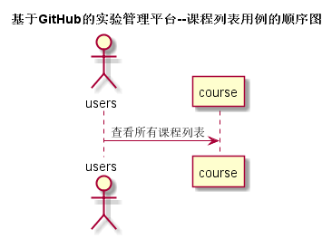

# “课程列表”用例 [返回](../README.md)
## 1. 用例规约

|用例名称|课程列表|
|-------|:-------------|
|功能|以表形式的显示出所有课程的信息|
|参与者|游客，学生，老师|
|前置条件|学生，老师需要先登录|
|后置条件| |
|主事件流| |
|备选事件流| |

## 2. 业务流程（顺序图） [源码](../src/CourseList.puml)
 

## 3. 界面设计
- 界面参照:
- API接口调用
    - 接口1：[getCourses](../inf/getCourses.md) 

## 4. 算法描述

- 无
    
## 5. 参照表

- [COURSES_TERMES](../DatabaseDesign.md/#COURSES_TERMES)
- [COURSES](../DatabaseDesign.md/#COURSES)
- [TESTS](../DatabaseDesign.md/#TESTS)