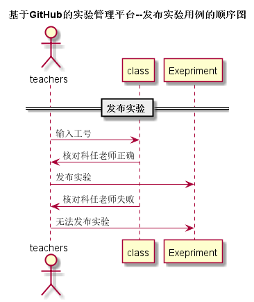

# “发布实验”用例 [返回](../README.md)
## 1. 用例规约

|用例名称|修改密码|
|-------|:-------------|
|功能|教师发布新的实验|
|参与者|老师|
|前置条件|教师必须先登录|
|后置条件|权限等级足够|
|主流事件|教师进入系统选择自己负责教学的班级，在班级所在的公布栏上发布实验要求和截止日期 |
|备注|必须是自己所教学的班级，否则无法发布实验要求内容 |

## 2. 业务流程 [源码](../src/PublishExepriment.puml)
 

## 3. 界面设计
- 界面参照: 
- API接口调用
    - 接口1：[PublishExepriment](../inf/PublishExepriment.md)

## 4. 算法描述
无
    
## 5. 参照表
TESTS
- [TESTS](../DatabaseDesign.md/#TESTS)